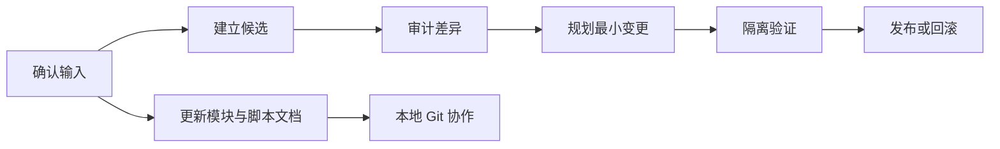

# 脚本工作域目录

`outputs/tools/` 保存迁移、审计、打包和门禁脚本。本文按工作域说明脚本解决什么问题，不描述具体实现。

## 快速定位

| 需求 | 工作域 |
| --- | --- |
| 确认输入可信、识别变化 | 输入盘点与证据固定 |
| 转换来源存档或客户端资料 | 转换与规范化 |
| 修复已上线但丢失的对象 | 三方审计与对象级恢复 |
| 处理保护区、群系、地形或高度 | 世界生成、保护区与高度策略 |
| 判断能否启动或发包 | 启动门禁与隔离验证 |
| 生成最小更新、回滚或导入 | 发布、导入与回滚 |
| 整理协作仓库 | 仓库维护与协作卫生 |

## 约定

- `audit`、`verify`、`validate` 通常是只读判断；`apply`、`restore`、`repair` 可能写入目标，必须有授权。
- `candidate`、`attempt`、`clone` 代表隔离演练，不能自动推导为生产环境。
- 真实世界变更优先采用对象级、可回滚 OTA；冲突默认保留当前服务器状态。

## 输入盘点与证据固定

**位置：** `outputs/tools/audit_*`、`inventory_*`、`hash_*`、`inspect_*`、`compare_*`

**职责：** 确认输入来源、目录形态、文件身份和快照差异，为后续决策建立稳定证据；不负责修复。

## 转换与规范化

**位置：** `outputs/tools/convert_*`、`migrate_*`、`prepare_fast_migration.py`、`normalize_*`

**职责：** 将来源版本的数据表达转换为目标版本可识别的表达，并保留转换边界。输出只进入 staging 或候选目录，不能直接取代线上世界。

## 三方审计与对象级恢复

**位置：** `outputs/tools/audit_*three_way*`、`create_storage_object_ota.py`、`protected_zone_*`、`*ota*.py`

**职责：** 在来源、转换候选和当前服务器状态之间识别可恢复、需重新编码和必须跳过的对象；默认不整区块或整 region 覆盖。

**主题：** 保险柜、储罐、漏斗过滤器、方块实体、保护区地形、POI、实体与物品账本。

## 世界生成、保护区与高度策略

**位置：** `outputs/tools/protected_zone_*`、`audit_terrain_*`、`validate_worldgen_*`、`pack/terrain-preservation-frontier-datapack-20260813`、`pack/worldgen-height-544-overlay-20260815`

**职责：** 管理受保护区域、原版参考地形、未来生成规则和高度扩展的边界。

**当前边界：** 主世界原版兼容生成与独立 frontier 可以分别维护；同主世界远端完整新地形且无断崖属于单独的未来能力。

## 启动门禁与隔离验证

**位置：** `outputs/tools/run_*gate*`、`preflight_*`、`verify_*installed*`、`start_*`、`launch_*`

**职责：** 启动前验证版本配对、配置、已知修复、端口和快照绑定关系；只在 disposable clone 内验证行为。结论只对绑定输入有效。

**边界：** 隔离启动不等于生产批准；MCModSync 不作为测试依赖。

## 发布、导入与回滚

**位置：** `outputs/tools/apply_*`、`build_*bundle*`、`import_*prism*`、`deploy_*ota*`、`restore_*`

**职责：** 形成范围明确、可回滚的变更包，或构建受控的客户端导入结果；清楚界定可变目标与永远不可触碰区域。

## 模组构建与补丁验证

**位置：** `outputs/tools/build_*`、`verify_*overlay*`、`test_*`，以及各 `projects/patches/*/tools/`

**职责：** 将源码、基础制品和兼容补丁组织为可验证候选；区分构建候选、最终制品和运行时文件，避免中间产物误投放。

## 客户端体验与地图资料

**位置：** `outputs/tools/convert_journeymap_to_xaero.py`、`*prism*`、`*client*`、`*resource*`

**职责：** 迁移客户端地图、资源与实例元数据；客户端缓存、私有画作缓存和用户偏好不能随服务器 OTA 发布。

## 仓库维护与协作卫生

**位置：** `tools/repository/`、`outputs/tools/build_collaboration_repo.py`、根目录 `check.ps1`

**职责：** 构建本地协作仓库、脱敏来源、刷新清单、检查禁入文件并保持资料可追溯；不接触运行时。

**关键规则：** 不提交世界、玩家身份、实际服务器地址、凭据、客户端实例、JAR/ZIP 或构建缓存；公开来源署名不能被脱敏流程误改。

## 简化协作流程

